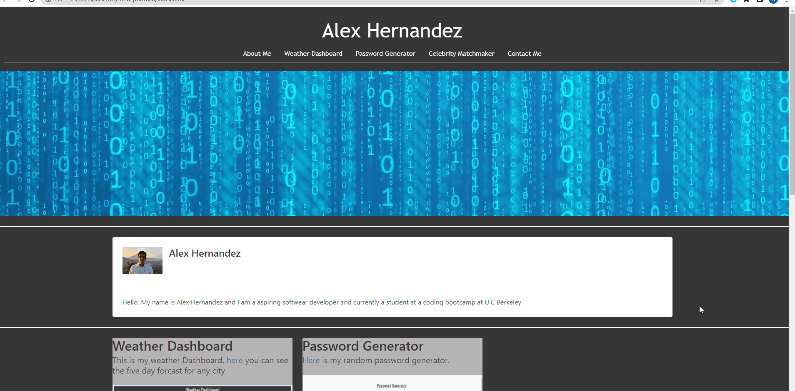

# my-new-portfolio

## Description
My team and I just finished a project, so to showcase the project I made a new portfolio.

## Installation
The tools I used for this are HTML, CSS and Bulma.io css framework. First the header, Even though we have Bulma.io I didn't see any I liked, so I made my header with a container with a h1 tag and bulma tabs. The Project pictures are in Bulma cards with links to the deployed site and GitHub repositories. The about me section is made out of a Bulma card container. Lastly the footer is made out of a Bulma footer and tiles. 

## Usage 
click [here](https://alex-h1.github.io/my-new-portfolio/) to deployed site.

## License
License under[ MIT License](license)